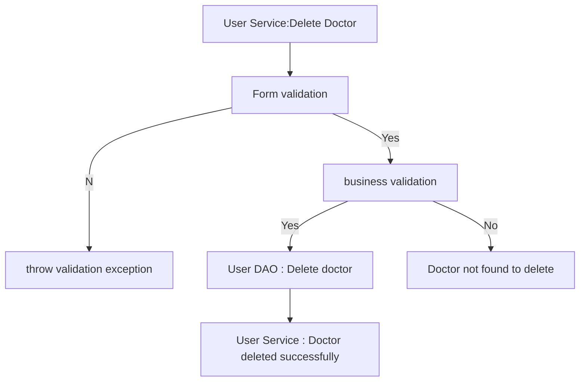
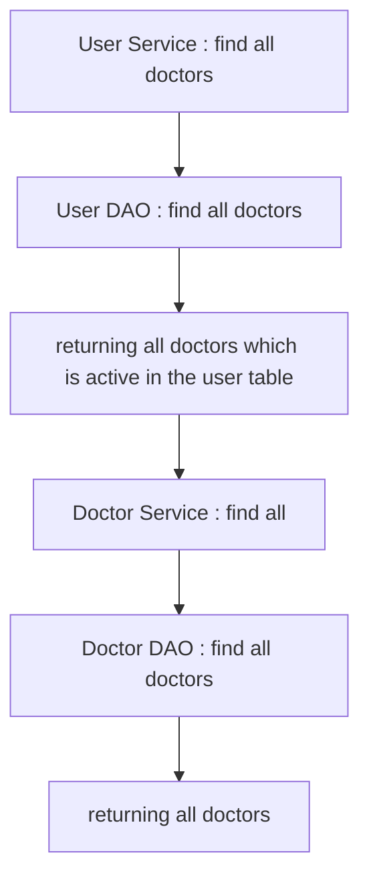
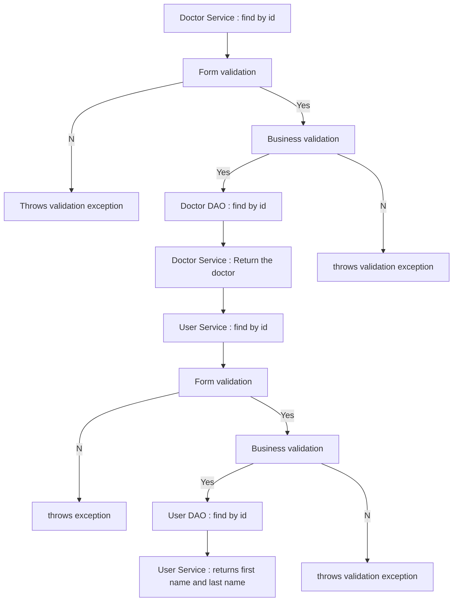

# CARE CENTRAL

## Database Design

- [ ] Create an ER diagram of the database
- [ ] Write Create table scripts 

[ER Diagram](path/to/ER/diagram)

## Project Setup

- [ ] Create a new Java project
- [ ] Set up a MySQL database
- [ ] Add necessary libraries
	- [ ] JDBC, 
	- [ ] MySQL Connector, 
	- [ ] JUnit, 
	- [ ] Dotenv

## Module: User 
### Feature: User creation
#### user story
- User can create their profile easily.
#### Pre-requisites:
- [ ] Create User table
- [ ] Implement User model
- [ ] Implement User DAO (create)

#### Validations:
 - [ ] Form validations
	- first name
	- Last name
	- Age
	- Email id 
	- Password
 - [ ] Business validations
	 - Check whether the email id already exists.

#### Messages: 
- [ ] Invalid Email Id
- [ ] Password doesn't match the required format
- [ ] first name cannot be null or empty
- [ ] last name cannot be null or empty
- [ ] mobile number does not match the required format
- [ ] User must be at least age of  17.
- [ ] User already exists (Business validation)

#### Flow: 

### Feature: Update User
#### User Story:
- User can update their profile details.
#### Pre-requisites:
- [ ] Implement user model 
- [ ] Implement user DAO (update)

#### Validations:
- [ ] Form validations
	- Validating the fields which the user is going to update(i.e. first name , last name , password , mobile number , age)
- [ ] Business validations
	- check whether the id exists.

#### Messages:
- [ ] Password doesn't match the required format
- [ ] first name cannot be null or empty
- [ ] last name cannot be null or empty
- [ ] mobile number does not match the required format
- [ ] User must be at least age of  17.
- [ ] Id cannot be negative.
- [ ] User not found
- [ ] User cannot be null or empty

#### Flow:

### Feature: Delete User
#### User Story:
- User can delete their account.
#### Pre-requisites:
- [ ] Implement user model
- [ ] Implement user DAO(delete)

#### Validations:
- [ ] Form validations
	- Check whether the id is valid or not
- [ ] Business validations
	- Check whether the id exists.

#### Messages:
- [ ] Invalid id 
- [ ] User not found

#### Flow:

### Feature: List User
#### Pre-requisites:
- [ ] Implement user model
- [ ] Implement user DAO(findAll)

#### Validations:
- [ ] No validations

#### Flow:

## Module: Doctor
### Feature: Doctor creation
#### User Story:
- Admin can upload the doctor detail.
#### Pre-requisites:
- [ ] Create Doctor's record in user table (should complete)
- [ ] Create Doctors table
- [ ] Implement doctor model
- [ ] Implement doctor DAO(create)

#### Validations: 
- [ ] Form validations
	- First name
	- Last name
	- Age 
	- Mobile number
	- Email id
	- Password
	- Qualifications
	- Experience (whether it is in year or month)
	- Department
- [ ] Business validation
	- Existence of email
	
#### Messages:
- [ ] Email cannot be null or empty
- [ ] Email doesn't match the required format
- [ ] Password doesn't match the required format
- [ ] first name cannot be null or empty
- [ ] last name cannot be null or empty
- [ ] mobile number does not match the required format
- [ ] User must be at least age of  17.
- [ ] User already exists (Business validation)
- [ ] Experience must be in years.
- [ ] Qualifications must not be null or empty.
- [ ] Department must not be null or empty
- [ ] User cannot be null or empty

#### Flow:

### Feature: Update Doctor
#### User Story:
- Doctors can update their profile.
#### Pre-requisites
- [ ] Implement Doctor model
- [ ] Implement Doctor DAO (update)

#### Validations
- [ ] Form validation
	- First name
	- Last name
	- Age 
	- Mobile number
	- Qualifications
	- Experience (whether it is in year or month)
	- Department
- [ ] Business validation
	- Existence of user id and doctor id

#### Messages:
- [ ] Password doesn't match the required format
- [ ] first name cannot be null or empty
- [ ] last name cannot be null or empty
- [ ] mobile number does not match the required format
- [ ] User must be at least age of  17.
- [ ] Experience must be in years.
- [ ] Qualifications must not be null or empty.
- [ ] Department must not be null or empty

#### Flow:

### Feature: Delete
#### User Story:
- Doctors can delete their profile.
#### Pre-requisites:
- [ ] Implementing user model
- [ ] Implementing user DAO(delete)

#### Validations:
- [ ] Form validations
	- valid id or not 
- [ ] Business validations
	- existence of id

#### Flow:

### Feature : Listing doctors
#### User Story:
- Users can see the list of Doctors.
#### Pre-requisites:
- [ ] Implement User Model
- [ ] Implement Doctor DAO
- [ ] Implement User DAO

#### Validations:
- [ ] No validations

#### Flow:

### Feature: Find doctors by id
#### User Story:
- Users can see the particular doctor details.
#### Pre-requisites:
- [ ] Implement User model
- [ ] Implement User DAO
- [ ] Implement Doctor DAO
- [ ] Implement Doctor model

#### Validations:
- [ ] Form validations 
	- Check whether the id is valid or not 
- [ ] Business validations
	- Existence of id in the table

#### Messages:
- [ ] Id cannot be negative.
- [ ] Id not found

#### Flow:

